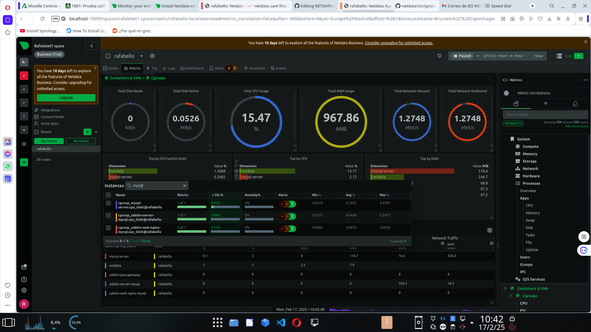

# Instalación de Netdata con Docker

Este documento proporciona instrucciones para instalar Netdata utilizando Docker. Netdata es una herramienta de monitoreo en tiempo real que ayuda a visualizar el rendimiento de sistemas y aplicaciones.

## Requisitos Previos

- Tener Docker instalado en tu sistema. Puedes seguir la [guía oficial de instalación de Docker](https://docs.docker.com/get-docker/).

## Instalación de Netdata con Docker

Ejecuta el siguiente comando para instalar y ejecutar Netdata en un contenedor Docker:

```bash
docker run -d --name=netdata \
  --pid=host \
  --network=host \
  -v netdataconfig:/etc/netdata \
  -v netdatalib:/var/lib/netdata \
  -v netdatacache:/var/cache/netdata \
  -v /:/host/root:ro,rslave \
  -v /etc/passwd:/host/etc/passwd:ro \
  -v /etc/group:/host/etc/group:ro \
  -v /etc/localtime:/etc/localtime:ro \
  -v /proc:/host/proc:ro \
  -v /sys:/host/sys:ro \
  -v /etc/os-release:/host/etc/os-release:ro \
  -v /var/log:/host/var/log:ro \
  -v /var/run/docker.sock:/var/run/docker.sock:ro \
  -v /run/dbus:/run/dbus:ro \
  --restart unless-stopped \
  --cap-add SYS_PTRACE \
  --cap-add SYS_ADMIN \
  --security-opt apparmor=unconfined \
  netdata/netdata
```

## Instalación de MySQL o MariaDB en Docker

Puedes instalar y ejecutar un contenedor con MySQL o MariaDB usando los siguientes comandos.

### Instalación de MySQL

```bash
docker run --name mysql-container -e MYSQL_ROOT_PASSWORD=tu_contraseña -d mysql:latest
```

Si deseas acceder a MySQL desde tu máquina local, mapea el puerto del contenedor al puerto de tu sistema:

```bash
docker run --name mysql-container -e MYSQL_ROOT_PASSWORD=root -p 3306:3306 -d mysql:latest
```

### Instalación de MariaDB

```bash
docker run --name mariadb-container -e MYSQL_ROOT_PASSWORD=tu_contraseña -d mariadb:latest
```

Para mapear el puerto de MariaDB:

```bash
docker run --name mariadb-container -e MYSQL_ROOT_PASSWORD=root -p 3306:3306 -d mariadb:latest
```

## Verificar que los contenedores estén en ejecución

Ejecuta el siguiente comando para listar los contenedores en ejecución:

```bash
docker ps
```

## Conectarse a MySQL o MariaDB

Para conectarte al servidor MySQL o MariaDB en el contenedor, usa el siguiente comando:

```bash
docker exec -it mysql-container mysql -u root -p
```

O para MariaDB:

```bash
docker exec -it mariadb-container mysql -u root -p
```

Introduce la contraseña configurada previamente cuando se te solicite.

## Configuración de Netdata para monitorear MySQL o MariaDB

Edita el archivo de configuración de Netdata para habilitar el monitoreo de MySQL o MariaDB:

```bash
echo "local:
user: 'netdata'
pass: 'netdata'
host: 'mariadb'
port: 3306" > /etc/netdata/python.d/mysql.conf
```

Verifica que el archivo se haya creado correctamente:

```bash
cat /etc/netdata/python.d/mysql.conf
```

## Crear un usuario en MySQL/MariaDB para Netdata

Conéctate al servidor MySQL o MariaDB y ejecuta los siguientes comandos para crear un usuario con permisos de monitoreo:

```sql
CREATE USER 'netdata'@'%' IDENTIFIED BY 'netdata';
GRANT USAGE, REPLICATION CLIENT, PROCESS, SELECT ON *.* TO 'netdata'@'%';
FLUSH PRIVILEGES;
```

## Verificación de monitoreo

Una vez configurado, Netdata debería comenzar a monitorear MySQL o MariaDB. Puedes acceder al panel de Netdata desde tu navegador en:

```
http://localhost:19999
```

---

Este documento proporciona una guía paso a paso para instalar y configurar Netdata junto con MySQL o MariaDB en contenedores Docker. Si tienes alguna duda o problema, consulta la documentación oficial de cada herramienta.



